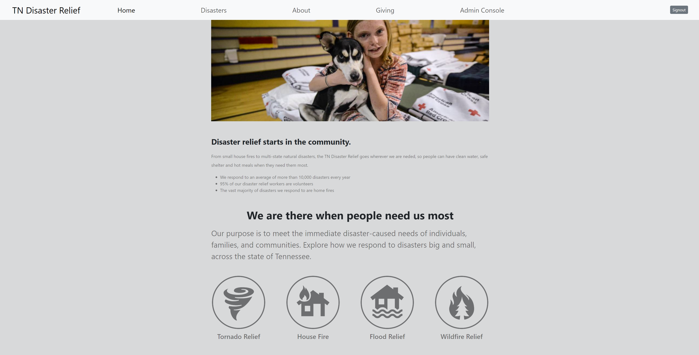
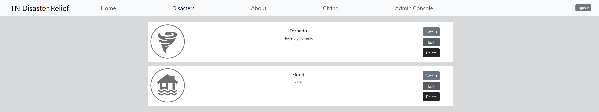
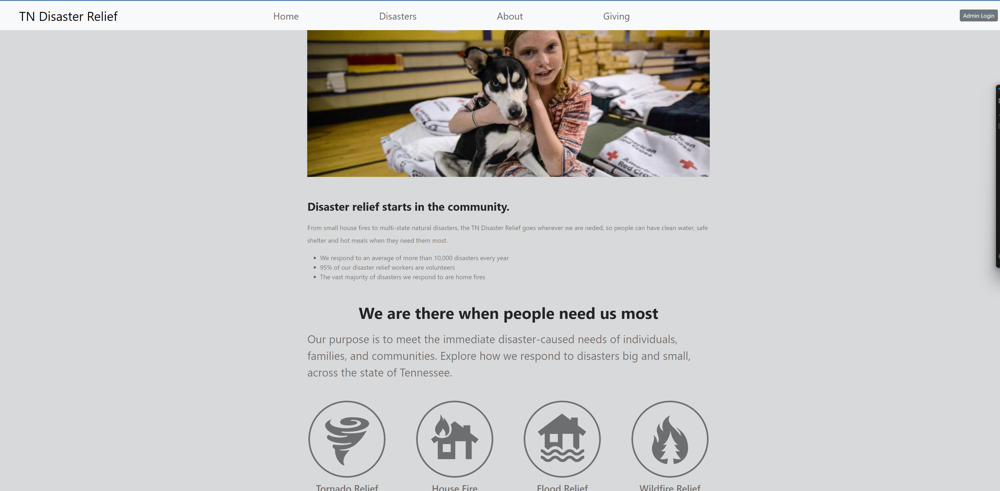
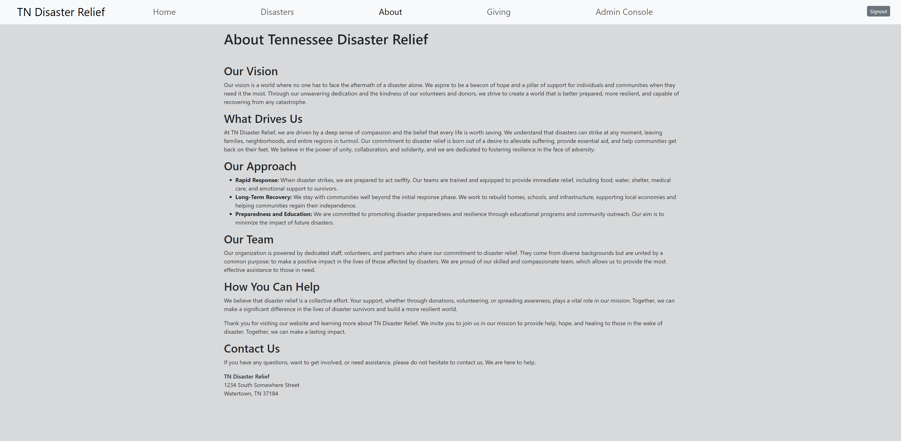
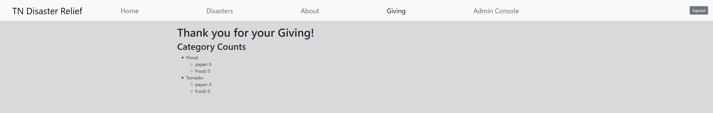
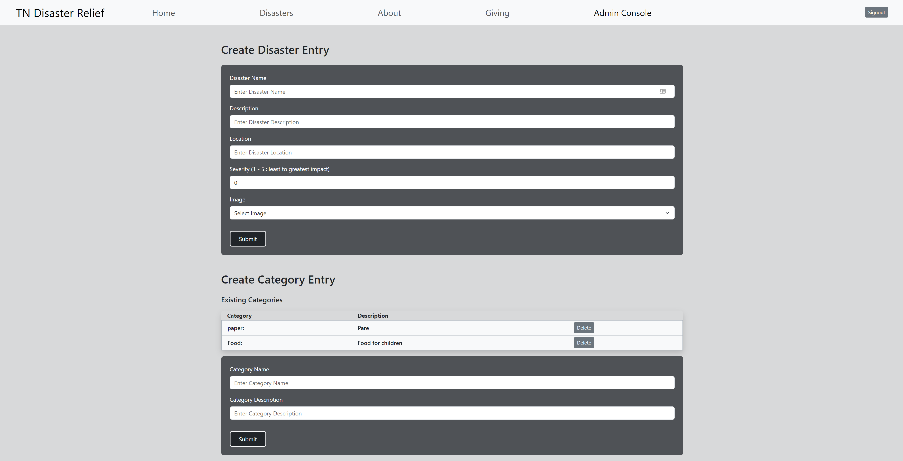
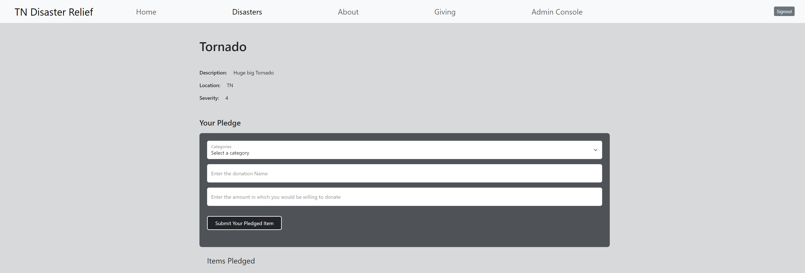
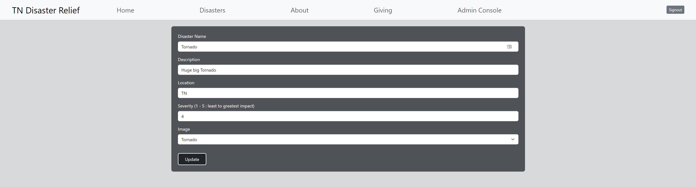

# FE/BE Disaster Reliefe
## Contributers:
Steve B
Dustin M
Nicholas D
Lucas M

___
## Starting the Project
1. Open front end and backend repo
2. Run this first in BE: dotnet user-secrets init
3. Then this code (replace <your_postgresql_password> with the password you created when installing PostgreSQL):
dotnet user-secrets set "DisasterReliefDbConnectionString" "Host=localhost;Port=5432;Username=postgres;Password=<your_postgresql_password>;Database=DisasterRelief"
4. Run this code to run migrations: dotnet ef database update
5. Open FE and do in terminal: npm run dev
6. Make sure Swagger is running and pgAdmin

## About Project:
Our page serves as an online platform that provides essential information, resources, and support to individuals and communities affected by natural disasters. Its primary functions include:
-Disaster Information: Providing up-to-date information about ongoing disasters, such as hurricanes, earthquakes, or wildfires including their severity, location, and impact.
-Donation Collection: Facilitating the collection of monetary and in-kind donations to support disaster relief efforts, which can include funds for rebuilding, medical supplies, or clothing.
Overall, a disaster relief page plays a critical role in coordinating and mobilizing resources and aid during crises, ensuring affected individuals and communities receive the assistance they need while promoting preparedness and resilience in the face of disasters.

BE GitHub URL: https://github.com/SteveCButler/disasterrelief-be
FE GitHub URL: https://github.com/ndswimming92/disaster-relief-e22-e24
Loom Video URL: https://www.loom.com/share/8d47427ff14643a891ef849281d2592a

## Site Pages: 

## Stack Used: 
HTML
CSS
React
dbdiagram
Figma
pgADmin
Swagger
